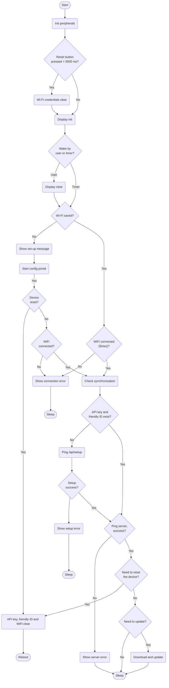

# TRMNL Firmware

created for the [TRMNL](https://usetrmnl.com) e-ink display.

## **Algorithm block scheme**



## **Web Server Endpoints**

following Wifi connection via the captive portal, device swaps its Mac Address for an API Key and Friendly ID from the server (which get saved on device).

```curl
GET /api/setup

headers = {
  'ID' => 'XX:XX:XX:XX:XX' # mac adddress
}

response example (success):
{ "status": 200, "api_key": "2r--SahjsAKCFksVcped2Q", "friendly_id": "917F0B", "image_url": "https://usetrmnl.com/images/setup/setup-logo.bmp", "filename": "empty_state" }

response example (fail, device with this Mac Address not found)
{ "status" => 404, "api_key" => nil, "friendly_id" => nil, "image_url" => nil, "filename" => nil }
```

assuming the Setup endpoint responded successfully, future requests are made solely for image / display content:

```curl
GET /api/display

headers = {
  'ID' => 'XX:XX:XX:XX',
  'Access-Token' => '2r--SahjsAKCFksVcped2Q',
  'Refresh-Rate' => '1800',
  'Battery-Voltage' => '4.1',
  'FW-Version' => '2.1.3',
  'RSSI' => '-69'
}

response example (success, device found with this access token):
{
  "status"=>0, # will be 202 if no user_id is attached to device
  "image_url"=>"https://trmnl.s3.us-east-2.amazonaws.com/path-to-img.bmp",
  "filename"=>"2024-09-20T00:00:00",
  "update_firmware"=>false,
  "firmware_url"=>nil,
  "refresh_rate"=>"1800",
  "reset_firmware"=>false
}

response example (success, device found AND needs soft reset):
{
 "status"=>0,
 "image_url"=>"https://trmnl.s3.us-east-2.amazonaws.com/path-to-img.bmp",
 "filename"=>"name-of-img.bmp",
 "update_firmware"=>false,
 "firmware_url"=>nil,
 "refresh_rate"=>"1800",
 "reset_firmware"=>true
}

response example (success, device found AND needs firmware update):
{
 "status"=>0,
 "image_url"=>"https://trmnl.s3.us-east-2.amazonaws.com/path-to-img.bmp",
 "filename"=>"name-of-img.bmp",
 "update_firmware"=>true,
 "firmware_url"=>"https://trmnl.s3.us-east-2.amazonaws.com/path-to-firmware.bin",
 "refresh_rate"=>"1800",
 "reset_firmware"=>false
}

response example (fail, device not found for this access token):
{"status"=>500, "error"=>"Device not found"}

if 'FW-Version' header != web server `Setting.firmware_download_url`, server will include absolute URL from which to download firmware.
```

if device detects an issue with response data from the `api/display` endpoint, logs are sent to server.

```curl
POST /api/logs

# example request tbd
```

## **Power consumption**

Ths image displays the amount of power consumed during a work cycle that involves downloading and displaying images.


This image displays the amount of power consumed while in sleep mode.


This image displays the amount of power consumed during a work cycle that involves link pinging, new firmware downloading and OTA.


Full Power Cycle

- Sleep 0.1mA
- Image refresh cycle 32.8mA during 24s

If refreshed continuously, device will refresh 8,231 times (54 hours) on a full charge.
If device is set to sleep continuously, it can sleep for 18,000 hours (750 days).

15 min refresh = 78 days
5 min refresh = 29 days

## **Low Battery Level**

This image shows that the battery disconnects when the voltage reaches 2.75 V:


The pulse on the graph shows the voltage on the divider in sleep mode, further on the graph it can be seen that at the moment of disconnection of the battery on the divider under load the voltage is equal to 1V, i.e. a voltage of 1.2V under load on the divider can be considered extremely critical, which corresponds to a voltage of 1.5V in the state sleep on the divider and 3V on the battery:


## **Version Log**

See [releases](https://github.com/usetrmnl/firmware/releases). For older versions go [here](https://github.com/usetrmnl/firmware/issues/95).

## **Compilation guide**

A more user-friendly (and non developer) guide is available here:
https://help.usetrmnl.com/en/articles/10271569-manually-flash-firmware

If you prefer to skip the build + upload steps below, flash directly from a web browser here: https://usetrmnl.com/flash.

1. Install VS Code: https://code.visualstudio.com
2. Install PlatformIO: https://platformio.org/install/ide?install=vscode
3. Install Git: https://git-scm.com/book/en/v2/Appendix-A%3A-Git-in-Other-Environments-Git-in-Visual-Studio-Code
4. Clone repository: https://github.com/usetrmnl/firmware
5. After cloning, open project in VS Code workspace
6. After configuring the project, click on the PlatformIO -> Build button located at the bottom of the screen


8. After the compilation process is complete, you should expect to see a message in the console.


9. You can find the compiled file in the folder shown in the picture.


## **Uploading guide (PlatformIO)**

1. Turn off PCB. Connect PCB to PC using USB-C cable. While holding down the boot button, turn on PCB. Let go of boot button. This puts board in flashing mode.

2. Mac/Windows: Select the proper COM port from drop-down list (or leave on "Auto"). Ubuntu: Look for something like "/dev/ttyACMO USB JTAG/serial debug unit" or "Espressif USB JTAG/serial debug unit" via lsusb.


3. Click on "PlatformIO: Upload" button.

## **Uploading guide (ESP32 Flash Download Tool)**

Tools required:

1. Windows OS
2. Flash Tool 3.9.5
3. [Firmware binary file](https://github.com/usetrmnl/firmware/tree/main/builds)
4. [Bootloader binary file](https://github.com/usetrmnl/firmware/tree/main/builds/bin/bootloader.bin)
5. [Partition binary file](https://github.com/usetrmnl/firmware/tree/main/builds/bin/partitions.bin)
6. [Boot app binary file](https://github.com/usetrmnl/firmware/tree/main/builds/bin/boot_app0.bin)

### Step 1 - Configure flash tool
open the Flash Tool (executable file), select these parameters, then clickOK:


### Step 2 - Add binaries
1. Beside the top blank space, click “...” dots and select the bootloader binary file then input 
> “0x00000000” 
in the far right space and check the box.

2. Click “...” dots and select the partitions binary file then input 
> “0x00008000” 
in the far right space and check the box.

3. Click “...” dots and select the boot_app0 binary file then input 
> “0x0000e000” 
in the far right space and check the box.

4. Click “...” dots and select the firmware binary file then input 
> “0x00010000” 
in the far right space and check the box.


finally, set the following parameters at the bottom of the Flash Tool interface:


### Step 3 - Connect and flash device
1. Open the Windows “Device Manager” program and scroll to the bottom where the USB devices can be found. each machine will have different available devices, but look for a section like this:


2. Next, connect the PCB to the Windows machine with a USB-C cable. make sure the USB port is on the right, and that the PCB’s on/off switch is toggled DOWN for “off.”

3. While holding the BOOT button (below the on/off toggle), toggle the device ON by flipping the above switch UP. you may hear a sound from your Windows machine Inspect the Device Manager connections at the bottom of the interface, and a new device should appear. it may be “USB Component {{ Num }},” or something like below:
 


4. Take note of this device’s name, that is our TRMNL PCB. then back inside the Flash Tool, click to open the “COM” dropdown in the bottom right and choose the TRMNL PCB. finally, click the “START” button.


### Step 4 - Prepare for new device flashing
Inside the Flash Tool click the “STOP” button.


Next turn off (toggle DOWN) and unplug the PCB. you are now ready to flash another device - see Step 1.

## **Hacking guide**

If you would like to run local tests, you'll need to have g++/gcc installed (f.e., as part of MinGW) in PATH:

- Get MinGW online installer from https://github.com/niXman/mingw-builds-binaries/
- Add path to `bin` from installed folder (f.e. `c:\mingw64\bin`) to your PATH
- Restart Visual Studio Code

Now you can switch from "env:esp32..." to "esp:native" clicking at the bottom of the studio (point 1):


And then run platformio tests by clicking test button (point 2).
